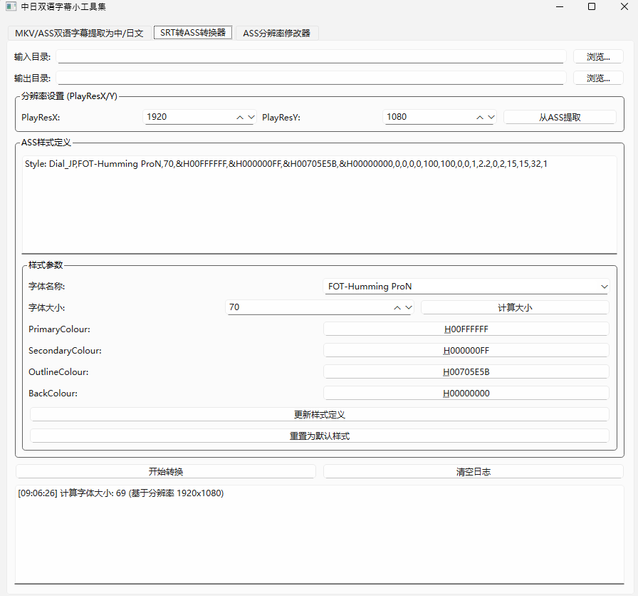
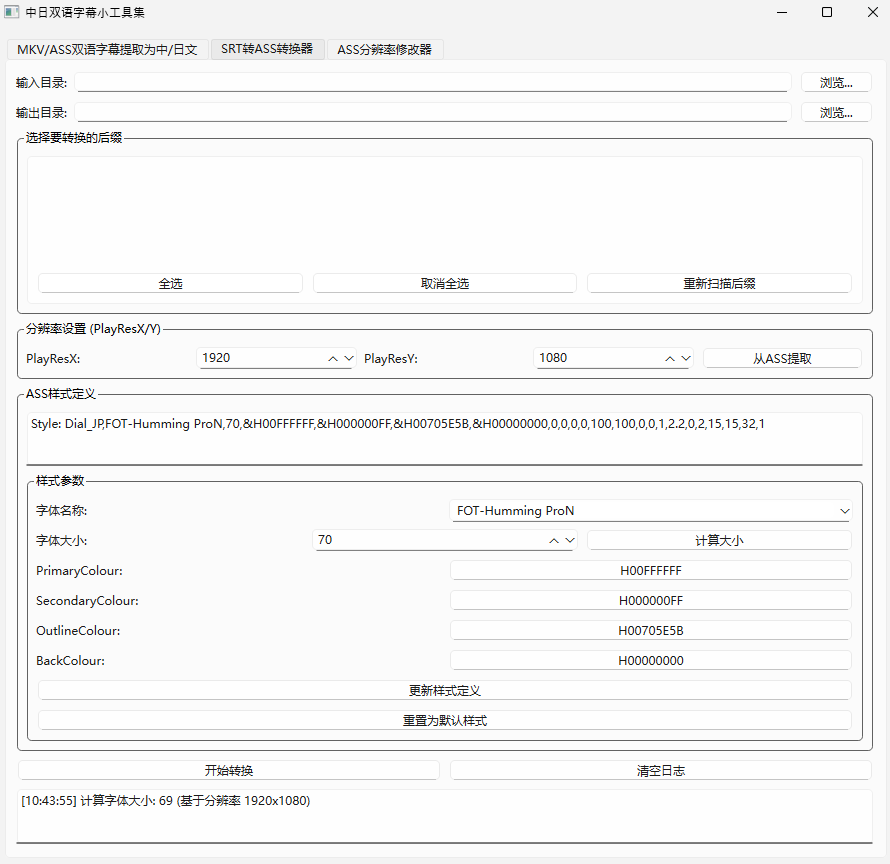
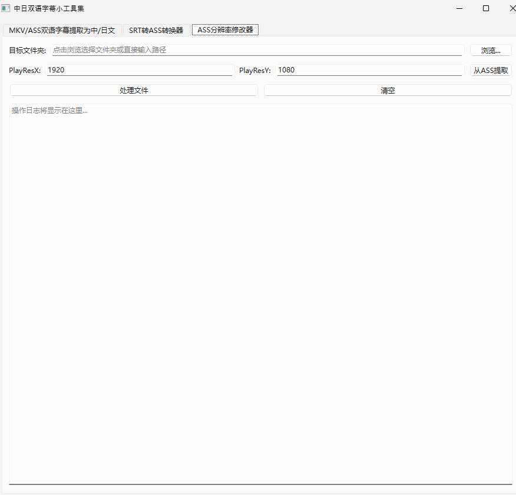

# SubtitleCoder

## 主要介绍
该软件主要分为三个主要功能：

1. 对中日双语视频MKV或ASS字幕文件中提取为相应的中文或日文字幕文件（ass或srt），并且可以自定义字幕轨道、提取后字幕大小等信息。
2. 对一个文件夹内的所有srt字幕文件，根据其他ass文件样式的参考或自己喜好设置分辨率大小，并且可以自己输入style样式或者调整样式参数，从而将srt文件转为ass文件。
3. 对一个文件夹内的所有ass字幕文件，根据据其他ass文件样式的参考或自己喜好设置分辨率大小，调整分辨率的大小。
   
### 名词解释：
- **分辨率：** 指的是ass字幕文件中，[Script Info]部分中的“PlayResX”和“PlayResY”两个参数，具体名称是“定义参考分辨率（Playback Resolution）”，字幕的坐标定位、缩放比例和显示效果。
  
  典型例子就是不同分辨率信息的ass字幕中，如果字体大小一致，会导致字体在屏幕中显示大小会不同，因为字体大小在显示器上展示的效果要根据字幕的分辨率信息的来决定，可能大小为70的字体在1920与1080的分辨率信息的字幕中，显示比较正常，但是如果在1280与720的分辨率信息的字幕中，如果要显示同样“大小”，就需要把字体大小调小，比如42等。
  
- **字幕轨道：** 视频中的轨道信息指的是mkv、mp4等视频中，往往有多个轨道，分别指的是图像、音频、字幕（主要是mkv）等， 这也是[MKVToolNix](https://mkvtoolnix.download/)和本软件提取字幕的核心根据。查看字幕的轨道信息可以用[MKVToolNix](https://mkvtoolnix.download/)来查看，一般而言，在大部分的中日双语、简繁、简体等动漫上，简体字幕的轨道ID为2，繁体字幕的轨道ID为3，故而本软件在字幕轨道上是默认设置为2，不过也有特殊例子，比如比如悠哉日常大王第二季繁日字幕版本中，繁体字幕轨道就是0，无简体字幕轨道，会导致软件提取字幕失败。所以如果提取字幕失败，建议用[MKVToolNix](https://mkvtoolnix.download/)查看字幕具体的轨道信息，然后在本软件中调整字幕轨道ID即可。

- **ASS字幕样式：** 在一般的ass文件中，均有[Script Info]、[V4+ Styles]和[Events]三大要素：

  1. 在[Script Info]，一般开始就是字体名称的定义，然后就是标题，缩放，分辨率等样式。
  2. 在[V4+ Styles]，就是字体样式定义，主要有样式名字（在后续的Events中用上）、字体名称、字体大小、字体颜色等不少样式。
  3. [Events]，这地方主要放字幕文本，其中有上述的样式名字，就是可以根据样式名字所对应的字体样式不同，从而让相应的文本显示不同的样式。

  **style样式：** mkv视频中ass字幕显示中，这部分样式的设定至关重要。style样式定义有：

  ```css
  Format: Name, Fontname, Fontsize, PrimaryColour, SecondaryColour, OutlineColour, BackColour, Bold, Italic, Underline, StrikeOut, ScaleX, ScaleY, Spacing, Angle, BorderStyle, Outline, Shadow, Alignment, MarginL, MarginR, MarginV, Encoding
  ```

  这部分在[V4+ Styles]中，从中可以看出第一个是样式名字，第二个是字体名称，接下来就是字体大小、字体颜色等等，比较多样。

  然后，一般而言，正常的动漫字幕会根据OP、ED和文本，以及中文简繁体字幕的不同，有设定不同的样式，现在为了方便处理，在第二个和第三个功能界面中，均只设置一行样式，即专门针对日语ass字幕的字体样式。

  接下来针对日语ass字幕的字体样式中，我搜集了几个比较合适的样式，方便大家使用：

  - Style: Dial_JP,FOT-UDKakugo_Large Pr6N B,72,&H00FFFFFF,&H000000FF,&H28131390,&H00000000,0,0,0,0,100,100,0,0,1,2,0,2,10,10,2,1
  - Style: Dial_JP,FOT-Seurat ProN B,72,&H00FFFFFF,&HFFFFFFFF,&H00000000,&H00000000,0,0,0,0,100,100,0,0,1,2,0,2,10,10,2,1
  - Style: Dial_JP,FOT-Seurat ProN B,72,&H006601FD,&H000000FF,&H00FFFFFF,&H00FFFFFF,0,0,0,0,100,100,0,0,1,3,0,2,10,10,10,1
  - Style: Dial_JP,FOT-Seurat ProN B,72,&H00FFFFFF,&H000000FF,&H005051E0,&H00000000,0,0,0,0,100,100,0,0,1,3,0,2,10,10,10,1
  - Style: Dial_JP,FOT-Seurat ProN B,65.0,&H0000008A,&H00FFFFFF,&H00EBEBEB,&H00EBEBEB,0,0,0,0,100.0,100.0,3.0,0.0,1,3.0,0.0,2,22,22,22,1
  - Style: Dial_JP,FOT-Seurat ProN DB,60.0,&H00FFFFFF,&H00FFFFFF,&H00E88600,&H00E88600,0,0,0,0,100.0,100.0,0.0,0.0,1,3.0,0.5,2,10,10,15,1
  - Style: Dial_JP,A-OTF Maru Folk Pro B,70,&H00FFFFFF,&H000000FF,&H31B050F4,&H00000000,-1,0,0,0,100,100,1,0,1,3,0,2,10,10,12,128
  - **Style: Dial_JP,FOT-Humming ProN,70,&H00FFFFFF,&H000000FF,&H00705E5B,&H00000000,0,0,0,0,100,100,0,0,1,2.2,0,2,15,15,32,1**

  本软件中，默认使用最后一个样式。只需要在界面中ass样式输入位置时，直接把其中一个拷贝进去就行。

## 功能介绍
### MKV/ASS双语字幕提取为中/日文
#### 介绍

对中日双语内封的mkv视频或双语ass字幕提取相应格式的ass中文/日文字幕，并且能够输出分辨率信息。其中，用户可以自定义调整字幕轨道和提取后的字幕的大小。

#### 限制

不能用于MPV4和部分MKV视频中的硬字幕，硬字幕指的是不能从视频拷贝字幕那种，针对硬字幕的解决方法只有从网上找字幕或者使用OCR方法识别字幕。

### SRT转ASS转换

#### 介绍

能够借鉴同个视频的中文ass字幕的分辨率信息，对网上找的日语srt字幕转换为合适分辨率信息的日语ass字幕。在本软件中，可以通过点击“从ass提取”中获取中文ass字幕的分辨率信息，另外，还可以在样式参数界面中调整重要参数，确定自己想要的参数。需要特别说明的是，本软件中，字体大小能够根据分辨率信息而自动调整。

### ASS分辨率修改

#### 介绍

根据参考的其他ass字幕的分辨率信息，对目标文件夹内所有ass字幕的分辨率信息进行调整，功能比较简单。

## 说明：

#### 1. 查找字幕说明

在搜集字幕中，尽量找简繁日内封或外挂的视频，这样处理会十分方便（甚至不需要本软件）。因为网上找的日语字幕大部分是srt，所以就需要尝试用本软件转换为相应的ass字幕，但是这引出一个新的问题：不同字幕组所制作的字幕所针对的视频来源可能不同，有的是BD，有的是WEB，甚至是有的对视频修改的，所以如果日语srt字幕与视频版本信息（或中文字幕）差距过大，有一定概率存在时间轴不对齐的问题，哪怕使用FFmpeg等都没法自动对齐，不过这情况比较少见，因为不少动漫的网上日语字幕来源比较多样，至少会有一种比较合适的，即可以找到不需要调轴就能用，或者调轴后可以正常使用。

调轴（自动对齐）工具推荐：[SubRenamer](https://github.com/qwqcode/SubRenamer)

查找日语字幕推荐网址：

-  [Jimaku](https://jimaku.cc/)
- [喵萌奶茶屋](https://github.com/Nekomoekissaten-SUB/Nekomoekissaten-Subs)

如果想查找中文字幕：

- [喵萌奶茶屋](https://github.com/Nekomoekissaten-SUB/Nekomoekissaten-Subs)
- [Anime字幕论坛](https://bbs.acgrip.com/)

#### 2. 视频内封字幕样式特别说明

在个别mkv动漫中（比如Lolihouse压制的结缘甘神神社）内封的字幕是srt文件，这导致不仅不能提取分辨率信息，反而让处理后的日语ass字幕中，如果使用PotPlayer等观看，“添加次字幕”从而让次要字幕与其他主字幕并排在下方居中时，ass字幕样式就出现严重变化，比如字体过于变大。对此的解决方法就是把视频的srt字幕提取出来，并且转为中文ass字幕就行（分辨率默认1920和1080都行）。

#### 3. 内封和内嵌特殊说明

一般而言，简繁日内封、简日内封、繁日内封、简繁日外挂、简日外挂、繁日外挂这几种情况都可以直接提取字幕信息，因为是软字幕，在PotPlayer等视频观看时，可以直接复制字幕。

但是如果是MP4这样硬字幕中，就没法提取字幕轨道，而且也没法复制，解决方法只能是网上找字幕或者使用OCR方法提取字幕。而内嵌就是这种情况，有的字幕组发简日内嵌MKV，尽管是MKV视频，但是字幕还是硬字幕。

# 软件界面

#### MKV/ASS双语字幕提取为中/日文



#### SRT转ASS转换



#### ASS分辨率修改



# 反馈

如果大家使用过程中有反馈，可以通过Issue反馈，或者发邮件给wei_xu_liu@163.com反馈，十分感谢。

# 未来修改计划
- [ ] 新增对ass文件的样式修改的模块 
- [ ] 尝试新增英语等其他语言的处理模块
- [ ] 完善字体下拉框的逻辑（**BUG:** Potplayer上，FOT-Humming ProN不能识别，而FOT-Humming ProN E和FOT-Humming ProN B能识别，而字体下拉框只能显示FOT-Humming ProN，不符合逻辑）

# 致谢

- [MKVToolNix](https://mkvtoolnix.download/) （灵感源泉之一）
- [VideoCaptioner](https://github.com/WEIFENG2333/VideoCaptioner) （灵感源泉之一）
- [PySide6-Code-Tutorial教程](https://github.com/muziing/PySide6-Code-Tutorial)
- [SubRenamer](https://github.com/qwqcode/SubRenamer)

